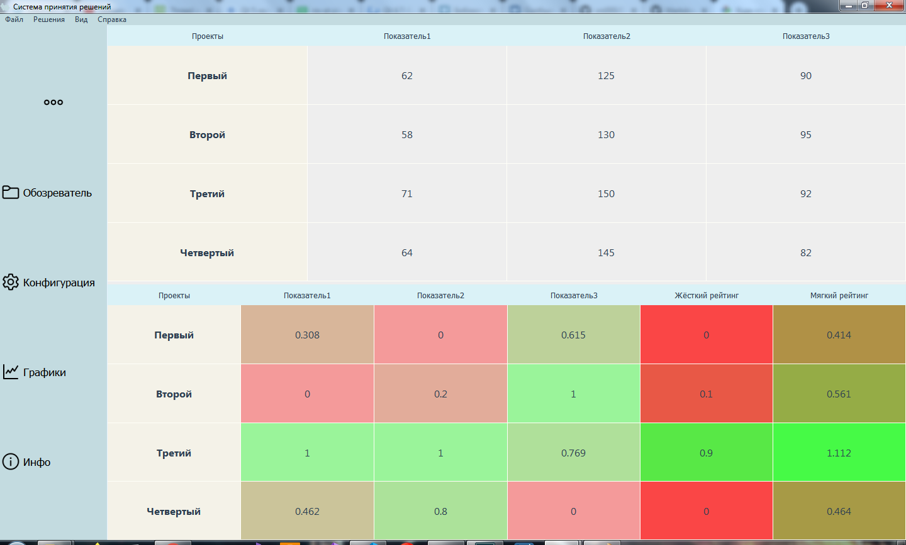
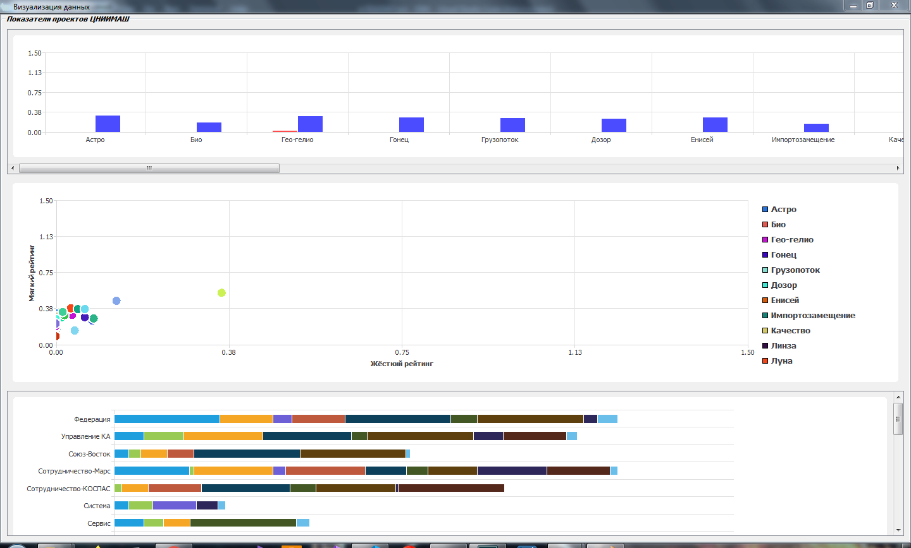

# СППР
![alt text][logo]

[logo]: images/4.PNG "Logo Title Text 2"
# Старт

## Убранное боковое меню
![alt text][logo1]

[logo1]: images/1.PNG "Logo Title Text 2"

## Расширенное боковое меню
![alt text][logo2]

[logo2]: images/3.PNG

# Загрузка таблицы

Осуществляется через Файл->Открыть или через "Обозреватель"

## Обозреватель

## Выбор конфигурации расчёта

## Результат

## В случае если показателей много информация может становиться трудночитаемой

## Для настройки предназначен пункт Вид

## Результат

# Визуализация данных
## Подготовка
### Перед построением имеется возможность выбрать:
* Количество выводимых проектов (в случае когда проектов очень много)
* Открытые решения для построения

## Результат построения

### В случае когда выбрано много проектов для построения имеется возможность вручную расширить графики.

### Для масштабирования размера предназначены следующие клавиши:

* D и A для увеличения и уменьшения размеров столбчатой диаграммы соответсвенно.

* S и W для увеличения и уменьшения размеров горизонтальной столбчатой диаграммы соответсвенно.

* R для сброса размеров к начальным

# Экспорт результатов
## Подготовка
### Вызов формы для экспорта осуществляется через Файл->Экспортировать в ... ->Excel

## Выбор параметров экспорта
### Имеется возможность выбора решений, функции окраски и авто построения графиков

## Выбор места для сохранения

## Результат

